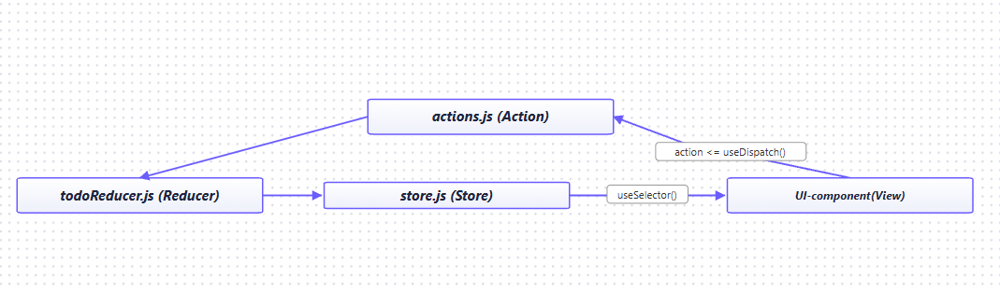

# React + Vite + Redux Toolkit

## Для запуска проекта

1. Форк репозитория
2. Клонирование `git clone`
3. Установки зависимостей `npm install`
4. Запуск live server'a `npm run dev`

## Описание Store

```javascript
import { configureStore } from "@reduxjs/toolkit";
import tasksReducer from "./tasksSlice";
import filterReducer from "./filterSlice";

export const store = configureStore({
  reducer: {
    tasks: tasksReducer, // Редюсер для тасок
    filter: filterReducer, // Редюсер для фильтра
  },
});
```

## Описание Slices

```javascript
import { createSlice } from "@reduxjs/toolkit";

const initialState = {
  tasks: [],
};

const tasksSlice = createSlice({
  name: "tasks",
  initialState,
  reducers: {
    loadTasks(state, action) {
      // Экшен для загрузки тасок из localStorage
      state.tasks = action.payload;
    },
    createTask(state, action) {
      // Экшен для создания таски
      state.tasks.push({
        ...action.payload,
        completed: false,
      });
    },
    editTask(state, action) {
      // Экшен для редактирования таски
      const task = state.tasks.find((t) => t.id === action.payload.id);
      if (task) task.title = action.payload.title;
    },
    completeTask(state, action) {
      // Экшен для смены статуса таски
      const task = state.tasks.find((t) => t.id === action.payload);
      if (task) task.completed = !task.completed;
    },
    deleteTask(state, action) {
      // Экшен для удаления таски
      state.tasks = state.tasks.filter((task) => task.id !== action.payload);
    },
    clearCompleted(state) {
      // Экшен для удаления всех выполненных тасок
      state.tasks = state.tasks.filter((task) => !task.completed);
    },
  },
});

export const {
  loadTasks,
  createTask,
  editTask,
  completeTask,
  deleteTask,
  clearCompleted,
} = tasksSlice.actions; // Экспорт экшенов

export default tasksSlice.reducer; // Экспорт редюсера
```

## Cравнение структуры классического Redux и Redux Toolkit

- ### redux - actions => reducer => store
- ### RTK - slice(actions + reducer) => store

## Что делает `configureStore`?

- Создает стор
- Комбинирует редюсеры в один корневой
- Подключает middleware + thunk
- По умолчанию включает redux DevTools

## Что делает `createSlice`

- Позволяет создавать отдельные срезы приложения
- Принимает объект редьюсеров и на их основе автоматически генерирует экшены
- Разрешает мутировать состояние напрямую

## Cколько примерно строк кода удалось убрать?

Учитывая что приложение небольшое, а так же создание отдельного слайса для фильтра и как следствие создания селектора, сократить удалось на ~ 20 строк

# React + Vite + Redux

## Cхема файлов Redux



## Пример Action

```javascript
export const deleteTask = (id) => ({ type: "DELETE", payload: id });
```

## Пример Reducer

```javascript
const initialState = {
  allTasks: [],
  filterMode: "FILTER_ALL",
};

export const todoReducer = (state = initialState, action) => {
  switch (action.type) {
    case "DELETE":
      return {
        ...state,
        allTasks: state.allTasks.filter((task) => task.id !== action.payload),
      };
    default:
      return state;
  }
};
```

## Про Provider, useSelector, useDispatch

- Provider - предоставляет доступ к стору дочерним компонентам
- useSelector - возвращает выбранную часть состояния, и подписывает компонент на его изменения
- useDispatch - возвращает функцию dispatch для отправки экшенов в стор
